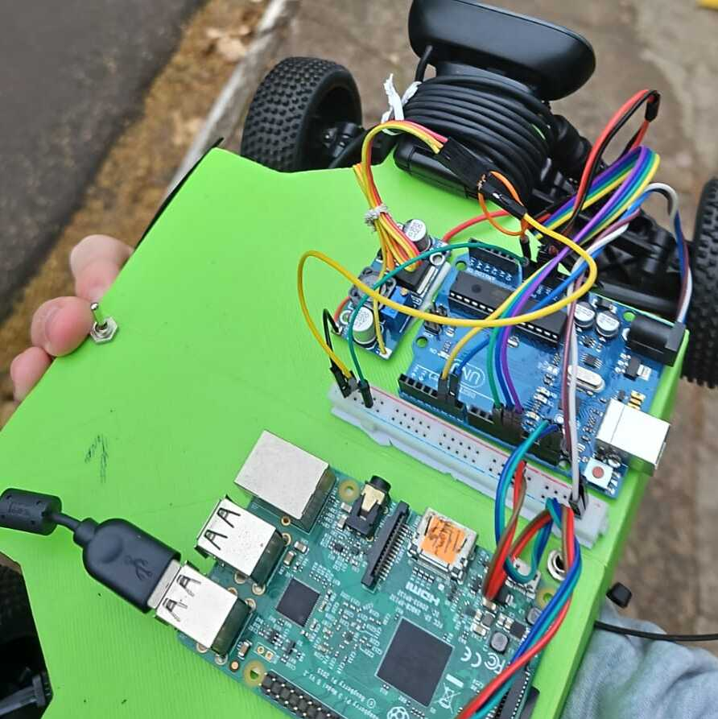
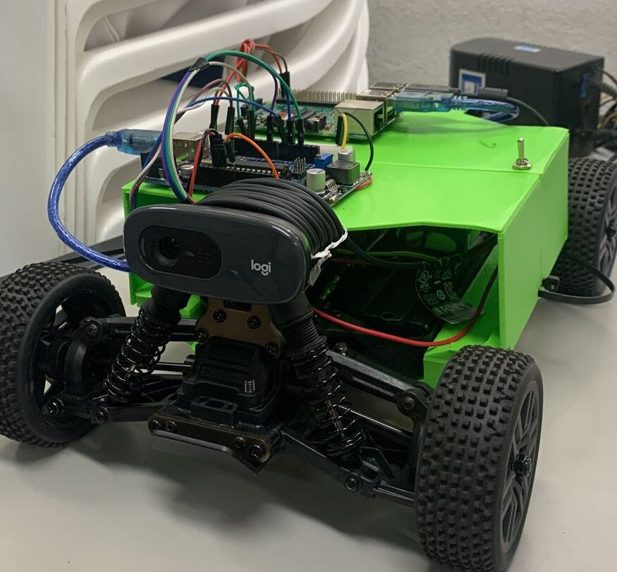

# Raspberry Node

Esse package faz referência ao Raspberry Pi que controla o robô. Para isso, foi utilizado um Raspberry Pi 3 Model B com 4GB de RAM.

## Raspberry Pi

  

    
  

  

    
  

O microcomputador utilizado para o projeto é um Raspberry Pi 3 Model B com 4GB de RAM com sistema operacional Ubuntu Server. O micro foi embarcado no chassi do robô e conectado a um módulo de comunicação serial para se comunicar com o Arduino.

## Instalação 

Para instalar o módulo da Raspberry Pi, é necessário seguir os seguintes passos:
- Instalar o Node.js e o npm
    - Recomendamos instalar a versão mais recente do Node (nosso caso é a 20)
    - Note que esse repositório já possui um `Node modules` já buildado, é possível usar ele
- Clonar o nosso repositório e usar o "raspberry_node" (esse package)
- Instalar as dependências do projeto com o comando `npm install` e buildar o projeto com o comando `npm run build`
- Iniciar a comunicação entre os micros e a porta de recebimento de comandos pelo comando `Node backend.js`
    - Note que é necessário configurar o arquivo `backend.js` para a porta serial correta
- Caso a raspberry não rode automaticamente em um thread separada por algum motivo a transmissão por FFMPEG que já está no `~/.bashrc`, o comando abaixo deve ser executado no terminal:
    - ffmpeg -s 640x360 -r 12 -i /dev/video0 -pix_fmt yuv420p -g 20 -c:v libx264 -b:v 1.5M -bufsize 52M -maxrate 10M -preset ultrafast -tune zerolatency -rtsp_transport tcp -f rtsp rtsp://<ip-da-instancia>:1935/iotcar

## Descrição do projeto

Do lado da Raspberry Pi, toda essa parte do projeto é baseado em NodeJS. Para isso, utilizamos o Socket.io para a comunicação em tempo real com o cliente. Todas as rotas de comunicações são abertas com HTTP (sem segurança).

Os comandos para controle do robô são recebidos pelo NodejS em formato WebSocket e vão pela porta serial para o arduino que controla os motores de acordo. 

O streaming de video é enviado por FFMPEG (por RSTP) para a porta `http://<ip-da-instancia>:1935` padrão de recebimento do MediaMTX. Então, o MediaMTX disponibiliza o streaming de vídeo na porta `http://<ip-da-instancia>:8888` (porta padrão de saída do MediaMTX). O streaming por padrão é feito em 640x360 com 12 frames por segundo e o delay médio obtido gira em torno da casa de 10 segundos.