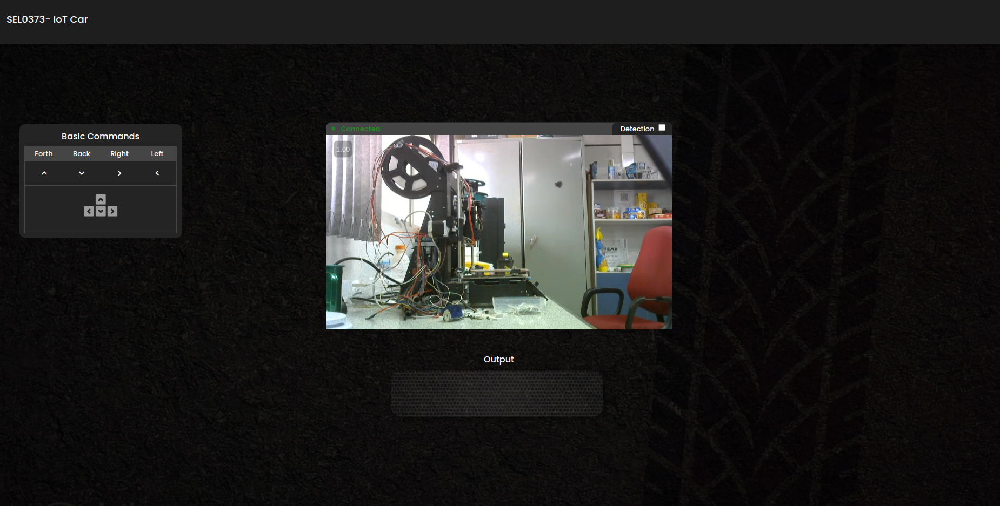

# Server Node

Esse package faz referência ao servidor que garante a comunicação do usuário com o projeto. Para isso, foi utilizado uma instância EC2 da AWS (Amazon Web Service).

## Instância EC2

As especificações da instância EC2 utilizada para o projeto são:
- Tipo de instância: c5.xlarge
- Sistema operacional: Ubuntu Server 20.04 LTS (HVM), SSD Volume Type
- Zona de disponibilidade: us-east-1d
- Portas abertas (TCP): 3000, 8888 e 1935.

## Instalação

Para instalar o servidor, é necessário seguir os seguintes passos:
- Instalar o Node.js e o npm
    - Recomendamos instalar a versão mais recente do Node (nosso caso é a 20)
- Clonar o nosso repositório e usar o "server_node" (esse package)
- Instalar as dependências do projeto com o comando `npm install` e buildar o projeto com o comando `npm run build`
- Iniciar o servidor com o comando `npm run dev`
- Habilitar o media MTX com o comando `./mediamtx`
    - Você pode configurar melhor as opções do MediaMTX pelo arquivo `mediamtx.yml`
- Acessar o servidor pelo endereço `http://<ip-da-instancia>:3000`
- É possível também acessar o streaming de vídeo pelo endereço: `http://<ip-da-instancia>:8888` (porta padrão de saída do MediaMTX)

## Descrição do projeto

Imagem demonstração do Fron-end:

Do lado do servidor, toda essa parte do projeto é baseado em NodeJS. Para isso, utilizamos o Socket.io para a comunicação em tempo real com o cliente. Todas as rotas de comunicações são abertas com HTTP (sem segurança). 

Os comandos de controle do robô são enviado pelo servidor através de NodeJS que utiliza WebSockets para enviar os comandos para o cliente. O cliente, por sua vez, recebe esses comandos e os envia para o robô através de um módulo de comunicação serial.

O streaming de video é enviado por FFMPEG (por RSTP) para a porta `http://<ip-da-instancia>:1935` padrão de recebimento do MediaMTX. Então, o MediaMTX disponibiliza o streaming de vídeo na porta `http://<ip-da-instancia>:8888` (porta padrão de saída do MediaMTX). Assim, o projeto pelo html acessar esse streaming em HLS e reproduz o vídeo em tempo real.
